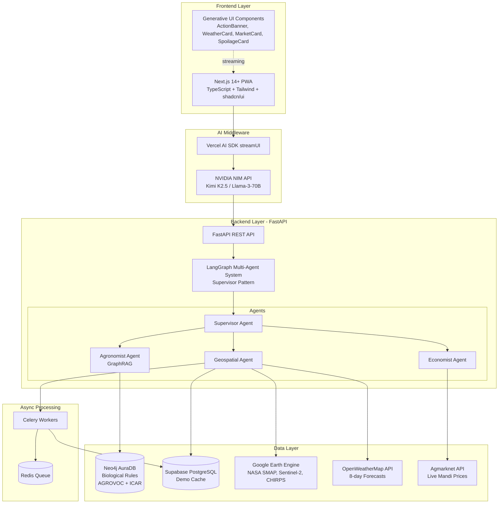
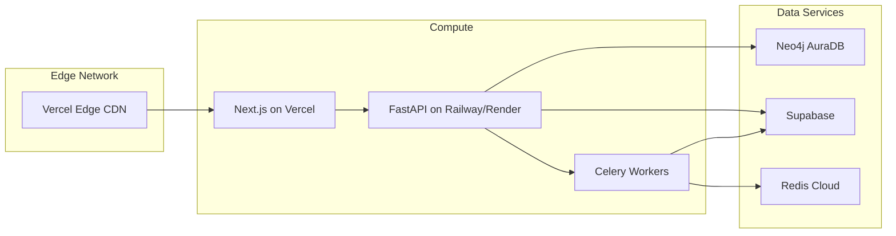

# Design Document: AgriChain Harvest Optimizer

## Overview

AgriChain is an Explainable AI (XAI) Trust Engine that eliminates post-harvest crop loss for Indian farmers through intelligent harvest timing and market recommendations. The system integrates hyper-local satellite data, real-time weather forecasting, and live market intelligence through a biological rules engine to deliver actionable advice optimized for low-end smartphones.

### Core Value Proposition

The system addresses a critical problem: farmers lose significant income by harvesting at suboptimal times (before storms) or selling at the wrong markets (flooded local Mandis). AgriChain acts as both a personalized Agronomist and Economist, delivering recommendations like "Harvest today, rain is coming, and Nagpur Mandi is paying ₹5 extra" through a Progressive Web App.

### Key Design Principles

1. **Explainability First**: Every recommendation includes transparent reasoning chains that farmers can understand and trust
2. **Performance on Constraints**: 2-second response times on low-end phones with slow 3G networks
3. **Scientific Rigor**: All advice validated against ICAR post-harvest guidelines and AGROVOC ontology
4. **Progressive Enhancement**: Streaming UI ensures farmers see critical information immediately while details load
5. **Offline Resilience**: PWA architecture enables access to previously loaded recommendations without connectivity

## Architecture

### System Architecture Diagram



### Technology Stack

**Frontend**
- Next.js 14+ (App Router, React Server Components)
- TypeScript (strict mode)
- Tailwind CSS + shadcn/ui components
- Vercel AI SDK (streamUI for Generative UI)
- lucide-react icons
- PWA configuration (next-pwa)

**AI Orchestration**
- NVIDIA NIM API (Kimi K2.5 or Llama-3-70B)
- Vercel AI SDK for streaming responses

**Backend**
- FastAPI (Python 3.11+)
- LangGraph (multi-agent orchestration)
- Pydantic v2 (data validation)

**Data Storage**
- Neo4j AuraDB (biological rules graph)
- Supabase PostgreSQL (caching layer)
- Redis (async task queue)

**External APIs**
- Google Earth Engine (satellite data)
- OpenWeatherMap One Call API 3.0
- Agmarknet API (Data.gov.in)
- AIKosh (fallback market data)

**Async Processing**
- Celery (distributed task queue)
- Redis (message broker)

### Deployment Architecture



## Components and Interfaces

### Frontend Components

#### 1. ActionBanner Component

**Purpose**: Display the primary recommendation with clear call-to-action

**Props**:
```typescript
interface ActionBannerProps {
  action: 'harvest_now' | 'wait' | 'sell_now';
  urgency: 'critical' | 'high' | 'medium' | 'low';
  primaryMessage: string;
  reasoning: string;
  confidence: number; // 0-100
  dataQuality: 'excellent' | 'good' | 'fair' | 'poor';
}
```

**Behavior**:
- Renders with urgency-based color coding (red for critical, yellow for high, green for medium, blue for low)
- Displays confidence level as a progress bar
- Shows data quality indicator
- Streams content progressively (message first, then reasoning)

#### 2. WeatherCard Component

**Purpose**: Display weather forecast with farmer-friendly explanations

**Props**:
```typescript
interface WeatherCardProps {
  forecast: {
    date: string;
    tempMax: number;
    tempMin: number;
    humidity: number;
    precipProbability: number;
    precipAmount: number;
    condition: string;
  }[];
  riskAssessment: {
    hasStormRisk: boolean;
    riskWindow: string; // "next 24 hours", "48-72 hours"
    impact: string; // plain language explanation
  };
  lastUpdated: string;
}
```

**Behavior**:
- Shows 8-day forecast in compact card format
- Highlights storm risks with warning icons
- Uses simple language ("Heavy rain expected tomorrow" vs "80% precipitation probability")
- Updates every 6 hours

#### 3. MarketCard Component

**Purpose**: Display market price intelligence and recommendations

**Props**:
```typescript
interface MarketCardProps {
  crop: 'tomato' | 'onion';
  markets: {
    name: string;
    location: string;
    pricePerKg: number;
    distance: number; // km from farmer
    lastUpdated: string;
  }[];
  recommendation: {
    bestMarket: string;
    priceDifference: number; // rupees
    reasoning: string;
  };
}
```

**Behavior**:
- Sorts markets by price (highest first)
- Shows price differences in rupees
- Calculates distance from farmer's location
- Highlights recommended market
- Updates daily

#### 4. SpoilageCard Component

**Purpose**: Display crop-specific spoilage risk based on biological rules

**Props**:
```typescript
interface SpoilageCardProps {
  crop: 'tomato' | 'onion';
  currentConditions: {
    temperature: number;
    humidity: number;
  };
  spoilageRisk: {
    level: 'critical' | 'high' | 'medium' | 'low';
    timeToSpoilage: string; // "24 hours", "3 days"
    factors: string[]; // ["High temperature", "High humidity"]
  };
  biologicalRule: {
    source: 'ICAR' | 'AGROVOC';
    rule: string; // plain language rule
  };
}
```

**Behavior**:
- Shows spoilage timeline with visual countdown
- Explains biological factors affecting spoilage
- Cites ICAR/AGROVOC sources for trust
- Color-codes risk levels

### Backend API Endpoints

#### 1. POST /api/recommendations

**Purpose**: Generate comprehensive harvest and market recommendation

**Request**:
```typescript
{
  farmerId: string;
  location: {
    latitude: number;
    longitude: number;
  };
  crop: 'tomato' | 'onion';
  fieldSize: number; // hectares
  language: 'en' | 'hi';
}
```

**Response** (Streaming):
```typescript
// Stream 1: Action Banner
{
  type: 'action',
  data: ActionBannerProps
}

// Stream 2: Weather Card
{
  type: 'weather',
  data: WeatherCardProps
}

// Stream 3: Market Card
{
  type: 'market',
  data: MarketCardProps
}

// Stream 4: Spoilage Card
{
  type: 'spoilage',
  data: SpoilageCardProps
}

// Stream 5: Detailed Reasoning
{
  type: 'reasoning',
  data: {
    chain: string[]; // step-by-step reasoning
    dataSources: {
      satellite: { source: string; timestamp: string; };
      weather: { source: string; timestamp: string; };
      market: { source: string; timestamp: string; };
      biological: { source: string; rule: string; };
    }
  }
}
```

**Processing Flow**:
1. Supervisor Agent receives request
2. Parallel dispatch to Geospatial, Agronomist, and Economist agents
3. Geospatial Agent checks cache, fetches satellite + weather data
4. Agronomist Agent queries Neo4j for biological rules
5. Economist Agent fetches market prices
6. Supervisor synthesizes results with NVIDIA NIM
7. Stream UI components progressively

#### 2. GET /api/cache/status

**Purpose**: Check cache status for a location

**Request**:
```typescript
{
  latitude: number;
  longitude: number;
}
```

**Response**:
```typescript
{
  cached: boolean;
  lastUpdated: string | null;
  dataAge: number | null; // hours
  expiresIn: number | null; // hours
}
```

#### 3. POST /api/cache/prefetch

**Purpose**: Trigger async satellite data prefetch for a location

**Request**:
```typescript
{
  latitude: number;
  longitude: number;
  priority: 'high' | 'normal' | 'low';
}
```

**Response**:
```typescript
{
  taskId: string;
  status: 'queued' | 'processing';
  estimatedTime: number; // seconds
}
```

#### 4. GET /api/biological-rules/{crop}

**Purpose**: Retrieve biological rules for a specific crop

**Request Parameters**:
- `crop`: 'tomato' | 'onion'
- `conditions`: JSON object with temperature, humidity

**Response**:
```typescript
{
  crop: string;
  rules: {
    id: string;
    condition: string;
    spoilageTime: string;
    source: 'ICAR' | 'AGROVOC';
    confidence: number;
  }[];
}
```

### Agent Specifications

#### Supervisor Agent

**Responsibilities**:
- Orchestrate multi-agent workflow
- Synthesize agent outputs into coherent recommendations
- Generate explainable reasoning chains
- Stream UI components progressively

**Inputs**:
- Farmer request (location, crop, language)

**Outputs**:
- Streaming UI components
- Reasoning chain with citations

**Decision Logic**:
```python
def synthesize_recommendation(
    geospatial_data: GeospatialData,
    biological_rules: BiologicalRules,
    market_data: MarketData
) -> Recommendation:
    # Priority 1: Weather urgency
    if geospatial_data.storm_within_48h and geospatial_data.crop_ready:
        return "harvest_now" with "critical" urgency
    
    # Priority 2: Spoilage risk
    if biological_rules.spoilage_risk == "critical":
        return "harvest_now" with "high" urgency
    
    # Priority 3: Market opportunity
    if market_data.price_spike and geospatial_data.crop_ready:
        return "sell_now" with "medium" urgency
    
    # Default: Wait for optimal conditions
    return "wait" with "low" urgency
```

#### Geospatial Agent

**Responsibilities**:
- Fetch and process satellite data (NDVI, soil moisture, rainfall)
- Integrate weather forecasts
- Assess crop readiness
- Manage caching layer

**Data Sources**:
- Google Earth Engine (NASA SMAP, Sentinel-2, CHIRPS, ISRO VEDAS)
- OpenWeatherMap One Call API 3.0
- Supabase cache

**Processing Pipeline**:
```python
async def get_geospatial_data(lat: float, lon: float) -> GeospatialData:
    # 1. Check cache
    cached = await check_supabase_cache(lat, lon)
    if cached and not expired(cached):
        return cached
    
    # 2. Trigger async fetch if not cached
    if not cached:
        task_id = await celery_fetch_satellite.delay(lat, lon)
    
    # 3. Fetch weather (always fresh)
    weather = await fetch_openweathermap(lat, lon)
    
    # 4. Calculate crop readiness
    crop_ready = calculate_readiness(cached.ndvi, cached.soil_moisture)
    
    # 5. Assess storm risk
    storm_risk = assess_storm_risk(weather)
    
    return GeospatialData(...)
```

**Caching Strategy**:
- Cache key: `{lat}_{lon}_{date}`
- TTL: 7 days
- Prefetch for demo locations (Maharashtra/Nagpur)
- Async background refresh for active farmers

#### Agronomist Agent (GraphRAG)

**Responsibilities**:
- Query Neo4j biological rules engine
- Match environmental conditions to spoilage rules
- Provide ICAR/AGROVOC citations
- Calculate spoilage timelines

**Neo4j Query Pattern**:
```cypher
// Find spoilage rules for crop under current conditions
MATCH (crop:Crop {name: $crop_name})
-[:HAS_RULE]->(rule:SpoilageRule)
WHERE rule.temp_min <= $current_temp <= rule.temp_max
  AND rule.humidity_min <= $current_humidity <= rule.humidity_max
RETURN rule.condition, rule.spoilage_time, rule.source
```

**Graph Schema**:
```
(Crop)-[:HAS_RULE]->(SpoilageRule)
(Crop)-[:REQUIRES]->(Condition)
(SpoilageRule)-[:CITES]->(Source)
(Crop)-[:RELATED_TO]->(Concept)
```

#### Economist Agent

**Responsibilities**:
- Fetch live Mandi prices from Agmarknet
- Compare prices across markets
- Calculate distance-adjusted recommendations
- Handle API fallbacks (AIKosh)

**Processing Logic**:
```python
async def get_market_recommendation(
    crop: str,
    farmer_location: tuple[float, float]
) -> MarketRecommendation:
    # 1. Fetch prices from Agmarknet
    try:
        prices = await fetch_agmarknet(crop)
    except APIError:
        prices = await fetch_aikosh_fallback(crop)
    
    # 2. Calculate distances
    markets_with_distance = [
        {**market, 'distance': haversine(farmer_location, market.location)}
        for market in prices
    ]
    
    # 3. Find best market (price - transport_cost)
    best = max(markets_with_distance, key=lambda m: m.price - transport_cost(m.distance))
    
    # 4. Calculate price difference
    local_market = min(markets_with_distance, key=lambda m: m.distance)
    price_diff = best.price - local_market.price
    
    return MarketRecommendation(best_market=best, price_difference=price_diff)
```

## Data Models

### Neo4j Graph Schema

#### Node Types

**Crop Node**:
```cypher
CREATE (c:Crop {
  id: string,
  name: string,
  scientific_name: string,
  category: string,
  agrovoc_uri: string
})
```

**SpoilageRule Node**:
```cypher
CREATE (r:SpoilageRule {
  id: string,
  condition: string,
  temp_min: float,
  temp_max: float,
  humidity_min: float,
  humidity_max: float,
  spoilage_time_hours: int,
  severity: string, // 'critical' | 'high' | 'medium' | 'low'
  source: string, // 'ICAR' | 'AGROVOC'
  source_reference: string
})
```

**Condition Node**:
```cypher
CREATE (c:Condition {
  id: string,
  name: string,
  type: string, // 'temperature' | 'humidity' | 'storage'
  optimal_min: float,
  optimal_max: float
})
```

**Source Node**:
```cypher
CREATE (s:Source {
  id: string,
  name: string,
  type: string, // 'ICAR_Manual' | 'AGROVOC' | 'Research_Paper'
  url: string,
  credibility: float
})
```

#### Relationships

```cypher
// Crop has spoilage rules
(Crop)-[:HAS_RULE {priority: int}]->(SpoilageRule)

// Crop requires specific conditions
(Crop)-[:REQUIRES {importance: string}]->(Condition)

// Rule cites source
(SpoilageRule)-[:CITES]->(Source)

// Crops related through AGROVOC
(Crop)-[:RELATED_TO {relationship_type: string}]->(Crop)

// Crop belongs to category
(Crop)-[:BELONGS_TO]->(Category)
```

#### Example Data

```cypher
// Tomato crop
CREATE (tomato:Crop {
  id: 'crop_tomato',
  name: 'Tomato',
  scientific_name: 'Solanum lycopersicum',
  category: 'Vegetable',
  agrovoc_uri: 'http://aims.fao.org/aos/agrovoc/c_7805'
})

// Spoilage rule for tomatoes
CREATE (rule1:SpoilageRule {
  id: 'rule_tomato_high_temp',
  condition: 'High temperature and humidity',
  temp_min: 30.0,
  temp_max: 45.0,
  humidity_min: 80.0,
  humidity_max: 100.0,
  spoilage_time_hours: 48,
  severity: 'critical',
  source: 'ICAR',
  source_reference: 'ICAR Post-Harvest Manual 2020, Page 45'
})

// ICAR source
CREATE (icar:Source {
  id: 'source_icar_manual',
  name: 'ICAR Post-Harvest Management Manual',
  type: 'ICAR_Manual',
  url: 'https://icar.org.in/post-harvest-manual',
  credibility: 0.95
})

// Relationships
CREATE (tomato)-[:HAS_RULE {priority: 1}]->(rule1)
CREATE (rule1)-[:CITES]->(icar)
```

### Supabase Cache Schema

#### Table: satellite_cache

```sql
CREATE TABLE satellite_cache (
  id UUID PRIMARY KEY DEFAULT gen_random_uuid(),
  latitude DECIMAL(10, 8) NOT NULL,
  longitude DECIMAL(11, 8) NOT NULL,
  date DATE NOT NULL,
  ndvi DECIMAL(5, 4),
  soil_moisture DECIMAL(5, 2),
  rainfall_mm DECIMAL(6, 2),
  data_sources JSONB, -- {smap: {...}, sentinel: {...}, chirps: {...}}
  created_at TIMESTAMP WITH TIME ZONE DEFAULT NOW(),
  expires_at TIMESTAMP WITH TIME ZONE DEFAULT NOW() + INTERVAL '7 days',
  UNIQUE(latitude, longitude, date)
);

CREATE INDEX idx_satellite_location ON satellite_cache(latitude, longitude);
CREATE INDEX idx_satellite_expires ON satellite_cache(expires_at);
```

#### Table: recommendation_history

```sql
CREATE TABLE recommendation_history (
  id UUID PRIMARY KEY DEFAULT gen_random_uuid(),
  farmer_id VARCHAR(255),
  latitude DECIMAL(10, 8) NOT NULL,
  longitude DECIMAL(11, 8) NOT NULL,
  crop VARCHAR(50) NOT NULL,
  recommendation JSONB NOT NULL, -- Full recommendation object
  confidence DECIMAL(5, 2),
  data_quality VARCHAR(20),
  created_at TIMESTAMP WITH TIME ZONE DEFAULT NOW()
);

CREATE INDEX idx_recommendation_farmer ON recommendation_history(farmer_id);
CREATE INDEX idx_recommendation_created ON recommendation_history(created_at);
```

#### Table: celery_tasks

```sql
CREATE TABLE celery_tasks (
  id UUID PRIMARY KEY DEFAULT gen_random_uuid(),
  task_id VARCHAR(255) UNIQUE NOT NULL,
  task_type VARCHAR(100) NOT NULL,
  status VARCHAR(50) NOT NULL, -- 'queued' | 'processing' | 'completed' | 'failed'
  params JSONB,
  result JSONB,
  error TEXT,
  created_at TIMESTAMP WITH TIME ZONE DEFAULT NOW(),
  updated_at TIMESTAMP WITH TIME ZONE DEFAULT NOW()
);

CREATE INDEX idx_celery_task_id ON celery_tasks(task_id);
CREATE INDEX idx_celery_status ON celery_tasks(status);
```

### Pydantic Models

```python
from pydantic import BaseModel, Field
from datetime import datetime
from typing import Literal

class Location(BaseModel):
    latitude: float = Field(..., ge=-90, le=90)
    longitude: float = Field(..., ge=-180, le=180)

class GeospatialData(BaseModel):
    ndvi: float = Field(..., ge=0, le=1)
    soil_moisture: float = Field(..., ge=0, le=100)
    rainfall_mm: float
    crop_ready: bool
    storm_within_48h: bool
    weather_forecast: list[dict]
    data_sources: dict
    timestamp: datetime

class BiologicalRule(BaseModel):
    id: str
    condition: str
    spoilage_time_hours: int
    severity: Literal['critical', 'high', 'medium', 'low']
    source: Literal['ICAR', 'AGROVOC']
    source_reference: str

class MarketData(BaseModel):
    crop: Literal['tomato', 'onion']
    markets: list[dict]
    best_market: str
    price_difference: float
    last_updated: datetime

class Recommendation(BaseModel):
    action: Literal['harvest_now', 'wait', 'sell_now']
    urgency: Literal['critical', 'high', 'medium', 'low']
    primary_message: str
    reasoning: str
    confidence: float = Field(..., ge=0, le=100)
    data_quality: Literal['excellent', 'good', 'fair', 'poor']
    components: dict  # UI component data
    reasoning_chain: list[str]
    data_sources: dict
```
