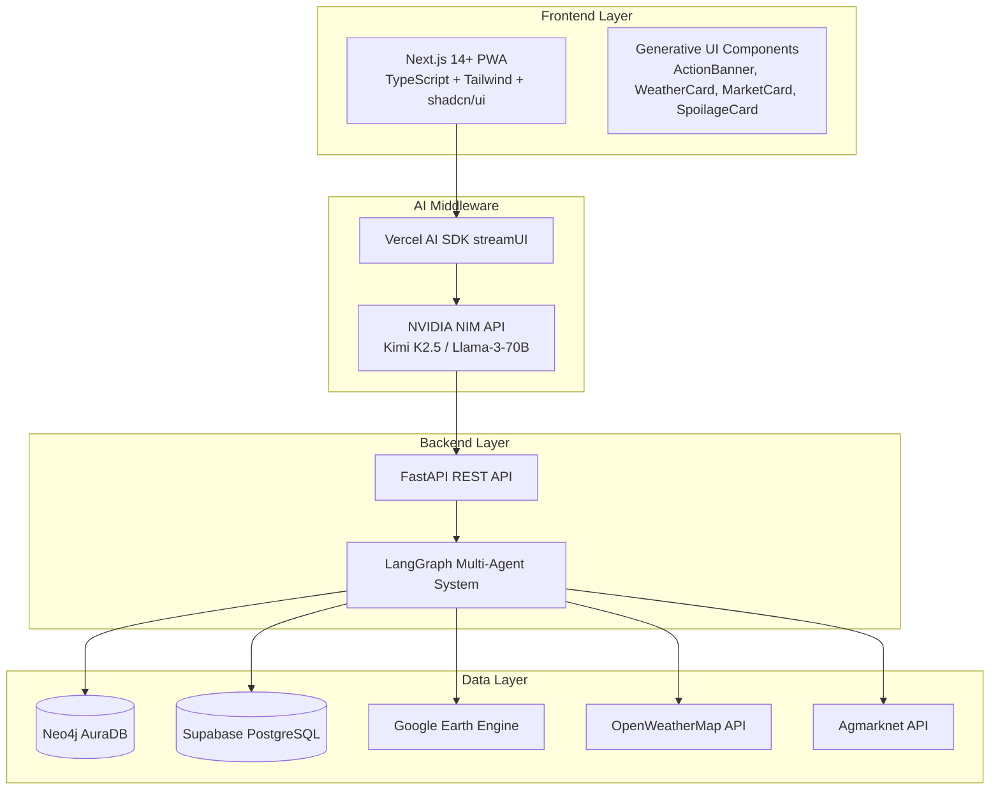

# 🌱 AgriChain: Farm-to-Market Intelligence Platform

**AgriChain** is an intelligent, farm-to-market recommendation engine designed specifically for Indian farmers. By acting as a "Trust Engine," it bridges the gap between complex agricultural data and actionable, plain-language advice to tell farmers exactly **when to harvest**, **where to sell**, and most importantly, **why** that is the best decision.

> 📄 **[View the full Design Document →](./DESIGN.md)** for comprehensive architecture, data models, API specifications, correctness properties, and implementation roadmap.

---

## ⚠️ The Problem

Despite advancements in agricultural techniques, India's farmers lose up to **40% of their produce post-harvest**. This massive loss is rarely due to poor farming practices; it is a logistics and information problem caused by:
- **Poor Timing:** Harvesting right before unseasonal rain or a heatwave.
- **Market Mismatch:** Selling at a local market flooded with supply, while a Mandi 50km away is paying a premium.
- **The "Trust Gap":** Existing agritech apps dump raw data onto farmers who lack data literacy. Farmers do not trust "black box" recommendations that lack reasoning.

---

## 💡 Our Approach (The Solution)

We are not just building a data dashboard; we are building an **Explainable AI (XAI) Trust Engine**.

### 1. The "Why" Over the "What"
Farmers will only take action if they trust the system. Instead of simply generating a command, AgriChain translates complex data overlaps into a natural language narrative.
> *Example: "Wait to harvest your wheat. Heavy rain is expected which increases crop damage risk, but Azadpur Mandi prices are rising and expected to be +₹200/quintal in 3 days."*

### 2. Intelligent Spoilage Risk Mitigation
Beyond the harvest, the system evaluates post-harvest transit. It calculates the biological clock of the specific crop against real-time temperature and transit distance, outputting ranked, cost-effective preservation actions (e.g., *"Elevate Grain Bags - Low Cost"* or *"Cover with Tarpaulin"*).

### 3. Reality-First UI/UX
Designed for a farmer holding a basic Android phone in a field with patchy 3G/4G internet. Heavy graphs, loading screens, and complex menus are completely eliminated in favor of **Action Cards** and **Progressive Disclosure**.

---

## 📱 App Interface & Features

*(Replace the image paths below with your actual repository image paths)*

### 1. Action-Oriented Dashboard
Instead of complex charts, farmers see an immediate, traffic-light status (e.g., "WAIT TO HARVEST") backed by simple, expandable "Why?" reasoning cards.


### 2. Live Market Intelligence
Compare current prices across nearby Mandis. See exactly how far away the market is and the current selling price per quintal.


### 3. Storage Risk & Preservation 
Real-time tracking of humidity and spoilage risks, accompanied by actionable, cost-ranked preservation tips that farmers can mark as complete.


---

## 🛠️ Technical Architecture & Tech Stack

AgriChain utilizes a **Multi-Agent Agentic Architecture** with progressive streaming UI to deliver complex AI reasoning with ultra-low latency on mobile networks.

### Architecture Overview



### Tech Stack

| Layer | Technology | Purpose |
|-------|-----------|---------|
| **Frontend** | Next.js 14+ (App Router), TypeScript, Tailwind CSS, shadcn/ui | Progressive Web App with streaming UI |
| **AI Orchestration** | NVIDIA NIM API (Kimi K2.5), Vercel AI SDK | LLM-powered recommendation synthesis |
| **Backend** | FastAPI (Python 3.11+), LangGraph, Pydantic v2 | Multi-agent orchestration & API layer |
| **Knowledge Graph** | Neo4j AuraDB (GraphRAG) | Biological rules engine (ICAR + AGROVOC) |
| **Caching** | Supabase PostgreSQL, Redis | Satellite data cache & async task queue |
| **Data Sources** | Google Earth Engine, OpenWeatherMap, Agmarknet, AIKosh | Satellite, weather, and market intelligence |
| **Async Processing** | Celery + Redis | Background satellite data fetching |

### Multi-Agent System

AgriChain uses a **Supervisor Pattern** with three specialized agents:

- **🛰️ Geospatial Agent** — Fetches satellite data (NDVI, soil moisture, rainfall) from Google Earth Engine + weather forecasts from OpenWeatherMap
- **🌿 Agronomist Agent (GraphRAG)** — Queries Neo4j biological rules engine for crop-specific spoilage thresholds validated against ICAR guidelines
- **💰 Economist Agent** — Fetches live Mandi prices from Agmarknet with AIKosh fallback, calculates distance-adjusted market recommendations

---

## ⚙️ How the System Works (Data Flow)

1. **Trigger:** The farmer opens the PWA. The app sends their location, crop type, and language preference to the backend.
2. **Orchestration:** The LangGraph Supervisor Agent dispatches requests to all three agents in parallel.
3. **Parallel Agent Execution:**
   - **Geospatial Agent** checks cache → fetches satellite data + weather forecast
   - **Agronomist Agent** queries Neo4j for biological spoilage rules
   - **Economist Agent** fetches live Mandi prices from Agmarknet/AIKosh
4. **Synthesis:** The Supervisor Agent synthesizes all agent outputs using NVIDIA NIM to generate an explainable recommendation.
5. **Streaming Delivery:** UI components stream progressively — ActionBanner first (critical decision), then WeatherCard, MarketCard, SpoilageCard, and finally the detailed reasoning chain.

---

## 🎯 Key Design Principles

| Principle | Description |
|-----------|-------------|
| **Explainability First** | Every recommendation includes transparent reasoning chains farmers can understand |
| **Performance on Constraints** | 2-second response times on low-end phones with slow 3G networks |
| **Scientific Rigor** | All advice validated against ICAR post-harvest guidelines and AGROVOC ontology |
| **Progressive Enhancement** | Streaming UI shows critical information first while details load |
| **Offline Resilience** | PWA enables access to cached recommendations without connectivity |
| **Graceful Degradation** | System always produces a recommendation, even with partial data failures |

---

## 🧪 Testing & Correctness

AgriChain defines **23 formal correctness properties** that are verified through property-based testing:

- **Property-based tests** (Hypothesis for Python, fast-check for TypeScript) — minimum 100 iterations per test
- **Unit test coverage** target: >80%
- **Integration tests** for all external API interactions
- **E2E tests** with Playwright for critical user journeys

See the [Design Document](./DESIGN.md#correctness-properties) for the full list of properties.

---

## 🚀 Getting Started

### Prerequisites
* Node.js 18+ & npm/yarn
* Python 3.11+
* Neo4j AuraDB Instance
* Redis
* API Keys for NVIDIA NIM, Google Earth Engine, OpenWeatherMap, and Agmarknet

### Installation

1. **Clone the repository:**
   ```bash
   git clone https://github.com/trishit3016/TSSS_AgriMitra.git
   cd TSSS_AgriMitra
   ```

2. **Backend Setup:**
   ```bash
   cd backend
   python -m venv venv
   source venv/bin/activate  # On Windows use `venv\Scripts\activate`
   pip install -r requirements.txt
   ```
   *Create a `.env` file in the backend directory and add your API keys.*

3. **Frontend Setup:**
   ```bash
   cd frontend
   npm install
   ```

4. **Run the Application:**
   * **Start FastAPI Server:** `uvicorn main:app --reload`
   * **Start Celery Workers:** `celery -A app.celery worker --loglevel=info`
   * **Start Frontend:** `npm run dev`

---

## 📖 Documentation

- [**Design Document**](./DESIGN.md) — Full architecture, data models, API specs, agent specifications, and implementation roadmap
- [**Requirements**](./REQUIREMENTS.md) — Detailed product requirements and acceptance criteria

---

## 🤝 Contributing
Contributions, issues, and feature requests are welcome! Feel free to check the [issues page](https://github.com/trishit3016/TSSS_AgriMitra/issues).

## 📄 License
This project is licensed under the [MIT License](LICENSE).